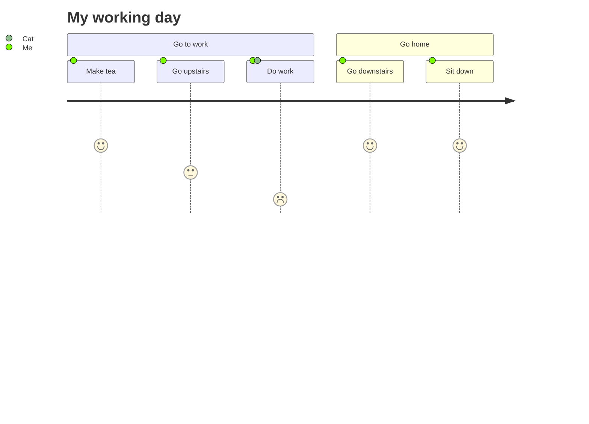

[//]: # (title: How-to-log-in switcher-label: Custom label)

To log in into a system:

1. Install Infra CLI
```bash
brew install infrahq/tap/infra
```

2. Login to Infra {id="pinning-and-unpinning-tabs"}

```bash
infra login SERVER
```
{prompt="$"}


3. See what you can access {id="splitting-and-unsplitting-editor-window"}

Run an infra list to view what you have access to:

```bash
infra list
```

4. Finish.

<table switcher-key="a">
<tr><td>Item 1</td><td>Item 3</td></tr>
<tr><td>Item 2</td><td>Item 4</td></tr>
</table>

<p switcher-key="b">Hello.</p>



```
```
{src="Program.cs"}